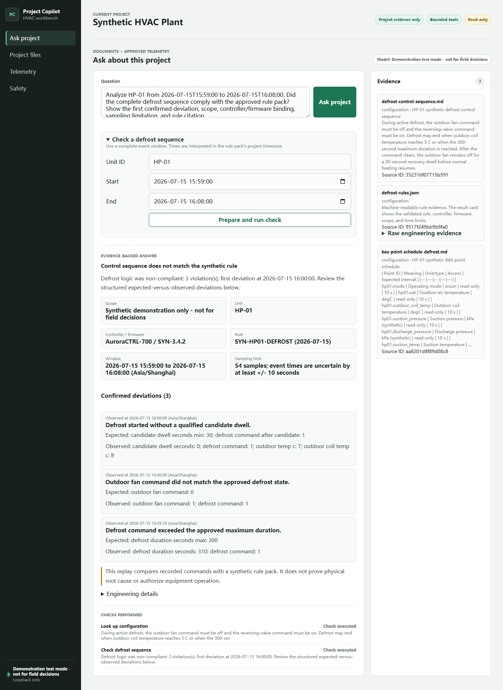
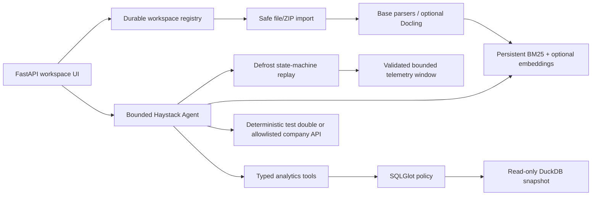

# Project Copilot Workbench

A public-safe project knowledge and governed analytics workbench. V2 adds
durable project workspaces, auditable imports, bounded Haystack tool use, cited
answers, and a fully synthetic HVAC evaluation suite.

## Four architecture trial

The local direction build keeps the current compact Chat at `/` and exposes
three architecture-level alternatives over the same model, private index,
read-only tools and source contract:

- `/versions` — comparison entry;
- `/versions/baseline` — frozen regression control;
- `/versions/conversation` — continuous questioning with a visible queue;
- `/versions/evidence` — answer plus on-demand evidence workbench;
- `/versions/canvas` — concise Chat plus a stable engineering deliverable.

The variants do not copy or fork the backend. Current independent review favors
the evidence workbench as the default foundation, the queue as a shared input
capability and the canvas only for complex tables/charts. The root route remains
unchanged until the Chairman completes direction acceptance.



## V2 capabilities

- Create, open, and switch durable project workspaces.
- Import selected files or a Project Package ZIP through the Web UI, API, or
  CLI; inspect parsing/indexing status; re-index or delete a source.
- Parse Markdown, UTF-8 text, JSON, and CSV in the base install. Optional
  PDF/DOCX/PPTX/XLSX parsing uses the pinned Docling Haystack integration,
  structured chunks, and an approved local tokenizer rather than a custom
  parser.
- Search each workspace with Haystack BM25 plus an optional company-approved
  embedding backend, reciprocal-rank fusion, and an optional approved local
  Sentence Transformers cross-encoder reranker.
- Run a bounded Haystack Agent with project search, configuration lookup,
  meeting/decision lookup, governed analytics, source inspection, and
  clarification tools.
- Offer a model-backed single-Chat direction surface that uses Haystack's
  maintained Responses API generator, iterative project retrieval, and a
  SQLGlot-guarded single-SELECT DuckDB tool for broader natural-language data
  questions.
- Return exact source citations, useful excerpts, sections/pages when the
  parser provides them, and a concise tool activity trace.
- Validate telemetry with Polars/Pandera, query a read-only DuckDB snapshot,
  and accept only typed analytics operations backed by SQLGlot-validated static
  SQL.
- Replay a versioned commercial-HVAC defrost rule pack over a bounded telemetry
  window with deterministic state transitions, first-deviation evidence, and
  explicit asset/controller/firmware scope; the Agent only routes and explains
  the governed result.
- Refuse unsupported evidence requests and prohibit arbitrary Shell, Python,
  Web, MCP, unrestricted SQL, and physical equipment control. The direction
  data tool accepts only one bounded read-only SELECT over an allowlisted table
  and fails closed when the generated query violates policy.

The repository contains only generic code and a CC0 fully synthetic HVAC
example. Real company data, endpoints, certificates, credentials, runtime
indexes, logs, and evaluation questions must remain outside the public clone.

## Architecture



See [architecture](docs/architecture.md), the accepted
[workspace ADR](docs/adr/002-v2-governed-workspace-agent.md), the
[defrost diagnostics ADR](docs/adr/003-defrost-temporal-diagnostics.md), and the current
[framework research](docs/research/2026-07-15-v2-framework-selection.md).

## Quick start

Windows PowerShell:

```bat
scripts\bootstrap.cmd
scripts\run.cmd
```

Open `http://127.0.0.1:8788`. The default deterministic mode is offline and
uses the bundled synthetic project.

The root URL now opens one Chinese Chat for the active workspace. Users upload
one or more files beside the composer; indexing runs automatically, and the
same Chat immediately answers from the imported workspace or performs governed
data analysis. Citations use the original filename as their primary label.
`/workbench` redirects to `/`; the older technical management page is not part
of the ordinary user workflow. Administrative CLI and workspace-scoped APIs
remain available for deployment and diagnostics. See the
[direction handoff](docs/agentic-rag-direction-handoff.md) before using the
bundled synthetic HVAC corpus as evaluation evidence.

Create and import a separate workspace from the CLI:

```powershell
project-copilot --runtime D:\ProjectCopilot\runtime `
  --create-workspace approved-hvac --display-name "Approved HVAC"
project-copilot --runtime D:\ProjectCopilot\runtime `
  --workspace approved-hvac --category meeting `
  --import-file D:\ApprovedProjects\meeting-2026-07-15.md
project-copilot --runtime D:\ProjectCopilot\runtime `
  --workspace approved-hvac --import-file D:\ApprovedProjects\package.zip
```

## Company model and embeddings

Production mode uses Haystack's OpenAI-compatible generator with an exact-host
allowlist, HTTPS enforcement for non-loopback endpoints, optional internal CA,
proxy inheritance disabled, zero retries, and strict tool schemas. Inject
secrets through an approved launcher; never store them in this repository.

Set `PROJECT_COPILOT_OPENAI_WIRE_API=responses` for a Responses-compatible
gateway. `chat_completions` remains supported for reviewed legacy endpoints.

```powershell
$env:PROJECT_COPILOT_OPENAI_API_KEY = Get-Secret -Name ProjectCopilot -AsPlainText
. .\config\company-v2.example.ps1 `
  -OpenAIBaseUrl "https://ai-gateway.example.invalid/v1" `
  -OpenAIModel "approved-model-id" `
  -AllowedHosts @("ai-gateway.example.invalid")
scripts\run.cmd
```

Embeddings are opt-in and require
`PROJECT_COPILOT_ACK_EMBEDDINGS_APPROVED=true`; without that acknowledgement,
the persistent BM25 path remains active. The legacy bounded AnythingLLM query
adapter remains for V1 compatibility, but it is not the V2 primary workflow.
LightRAG is documented only as an isolated loopback A/B candidate and is not
wired into V2. Stable v1.5.4 is restricted to fully synthetic data while the
security fixes first released in v1.5.5rc1 await a stable release and renewed
review.

## Evaluation and verification

```bat
scripts\verify.cmd
```

Run the frozen offline evaluation and write per-case evidence:

```powershell
.venv\Scripts\python.exe -m evaluation.run_offline `
  --output evaluation\results\deterministic-baseline.json
.venv\Scripts\python.exe -m evaluation.run_hvac_role_benchmark `
  --output evaluation\results\hvac-role-benchmark.json
.venv\Scripts\python.exe scripts\generate_agentic_hvac_bakeoff.py
.venv\Scripts\python.exe evaluation\run_agentic_rag_bakeoff.py
```

The gate covers unit/integration/security mutation cases, deterministic
retrieval/answer/tool/refusal evaluation, public-release scanning, Ruff, and
desktop/mobile browser acceptance in CI. Packaging CI also builds and installs
the wheel, runs `pip-audit`, emits a CycloneDX SBOM, runs LicenseCheck, and
executes Gitleaks.

The final real-model Agentic RAG run is retained at
`evaluation/results/agentic-rag-haystack-duckdb-live-v35.json`. It completed
52/52 requests with zero execution failures and passed 52/52 structural
behavior checks, 52/52 tool contracts, and 44/44 exact evidence contracts.
These are automatic structure/grounding checks, not an answer-correctness
percentage; the separate 52-case HVAC adjudication is retained under
`evaluation/reviews/` and accepted 52/52 final answers with result SHA
`f17bf6a25f333570ebb73daeb3c43bed13069438c19c32b5bf27a1208285fbca`.
The bounded direction Agent uses at most 11 steps, 10 tool calls, and 180
seconds per request.

The harder final four-version benchmark is intentionally reported separately
from the earlier narrow 52-case contract. Its 14 real-model requests all
completed, but only 1/14 passed the automatic hard gate; independent HVAC
review scored pass 0, partial 6 and fail 8 (21.4/100). This means the four UI
routes are valid architecture trials, not proof that the shared backend already
matches an expert general-purpose Chat. See
`evaluation/reviews/four-version-complex-benchmark-human-review-20260718.md`.

The final release wheel is 4,610,767 bytes (about 4.6 MB). The wheel and source
distribution exclude benchmark `hidden_truth`. The measured source, configuration, and
business-data payload is about 51 MB; RAGFlow's 50 GB allowance belongs to its
complete multi-service deployment and is not a requirement for this workbench.

The current deterministic baseline contains 23 frozen cases. It includes five
defrost time-window replays over an 8,640-row, ten-second synthetic day plus a
Chinese equipment-control refusal. A second 16-case benchmark creates isolated
data/runtime areas for commercial-HVAC design, commissioning, field service,
and project delivery; defrost is only one of its knowledge and data-analysis
workflows. See
[evaluation](docs/evaluation.md) for measured counts, ranking values, and
limitations.

## Deployment and operations

- [Company Windows deployment runbook](docs/company-deployment-v2.md)
- [Zero-context company-PC Agent handoff](docs/company-agent-handoff.md)
- [Administrator and user guide](docs/admin-user-guide.md)
- [Acceptance checklist](docs/acceptance-checklist.md)
- [Evaluation method and limitations](docs/evaluation.md)
- [Agentic RAG direction-build and continuation handoff](docs/agentic-rag-direction-handoff.md)
- [Codex runtime synthetic evaluation and Windows security prerequisite](docs/codex-runtime-deployment.md)
- [Optional LightRAG direct-deploy profile](docs/light-rag-direct-deploy.md)

The application binds only to `127.0.0.1`, `localhost`, or `::1`. It has no
built-in multi-user authentication; any reverse proxy or container exposure
requires a separate reviewed security design.

## Licenses

- Source code and documentation: Apache-2.0.
- `examples/synthetic_hvac`: CC0-1.0.
- Dependencies retain their upstream licenses; see
  [third-party notices](THIRD_PARTY_NOTICES.md).
