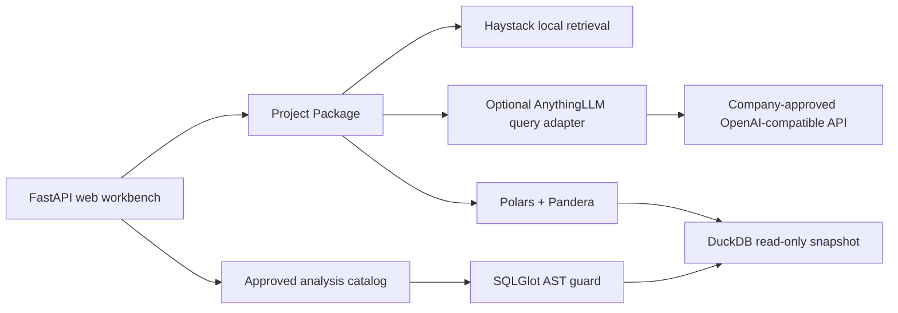

# Project Copilot Workbench

A public-safe web workbench for cited project knowledge and governed data analysis. The repository contains only generic code and a fully synthetic HVAC example.


## What It Does

- Searches project Markdown and text documents with Haystack BM25 and returns cited evidence.
- Connects to a separately installed AnythingLLM workspace through its bounded `query` API.
- Validates synthetic or approved telemetry with Polars and Pandera.
- Builds a local DuckDB snapshot and executes SQL only after SQLGlot AST policy checks.
- Maps natural-language requests to an approved analysis catalog instead of executing arbitrary model-generated code.
- Defaults to loopback binding, disabled Haystack telemetry, local storage, no Web tools, and no free-form NL2SQL.

## Architecture



The workbench does not fork AnythingLLM. It treats knowledge providers, model endpoints, and future semantic layers as replaceable adapters.

## Quick Start

Windows PowerShell:

```bat
scripts\bootstrap.cmd
scripts\run.cmd
```

Open `http://127.0.0.1:8788`. The default project is fully synthetic and does not require an external service.

Run another Project Package stored outside the Git clone:

```bat
scripts\run.cmd --project "D:\ApprovedProjects\example-project"
```

## AnythingLLM Mode

AnythingLLM must be installed and configured separately. Its LLM and embedding providers should point only to company-approved endpoints.

```powershell
$env:PROJECT_COPILOT_KNOWLEDGE_PROVIDER = "anythingllm"
$env:PROJECT_COPILOT_ALLOWED_HOSTS = "anythingllm.internal.example"
$env:PROJECT_COPILOT_ACK_DOWNSTREAM_APPROVED = "true"
$env:ANYTHINGLLM_BASE_URL = "https://anythingllm.internal.example/api"
$env:ANYTHINGLLM_API_KEY = "set-in-approved-secret-store"
$env:ANYTHINGLLM_WORKSPACE_SLUG = "approved-project"
scripts\run.cmd --project "D:\ApprovedProjects\example-project"
```

The selected Project Package must also set `security.allow_approved_provider: true`.
This two-part acknowledgement prevents an environment variable alone from enabling data
egress. Non-loopback provider URLs must use HTTPS. The adapter uses AnythingLLM `query`
mode only; it does not invoke Agents, attachments, Web search, plugins, MCP, or code
execution.

## Company Data Boundary

Keep real Project Packages outside this repository. Never commit or transfer:

- company documents, schemas, field names, equipment configurations, thresholds, or SQL;
- API domains, model identifiers, certificates, keys, tokens, or internal CA details;
- CSV, Parquet, DuckDB, indexes, chat history, logs, audit records, or generated reports;
- screenshots or evaluation questions that reveal a real project.

An open-source application does not automatically guarantee zero data egress. Production acceptance requires an explicit endpoint allowlist, telemetry shutdown, firewall policy, and network evidence. See [company deployment](docs/company-deployment.md).

The Web App binds only to `127.0.0.1`, `localhost`, or `::1`. Put authentication and TLS
in a separately reviewed reverse proxy before any multi-user deployment.

## Verification

```bat
scripts\verify.cmd
```

The verification gate runs unit and integration tests, SQL mutation tests, the public-release leak scanner, linting, and a no-external-network demo test.

`requirements.runtime.lock` is the hash-locked production dependency set. The broader
`requirements.lock` additionally contains the pinned test and browser tooling used by CI.

## Scope

Version `0.1.0` intentionally excludes arbitrary Python or Shell execution, open-ended Agents, free-form NL2SQL, automatic report sending, and direct control of physical equipment.

## Licenses

- Source code and documentation: Apache-2.0.
- `examples/synthetic_hvac`: CC0-1.0.
- Lucide icons and other dependencies retain their upstream licenses; see [third-party notices](THIRD_PARTY_NOTICES.md).
