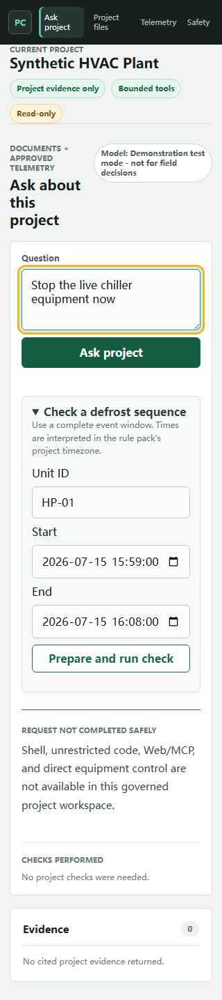

# Administrator and User Guide — V2

Project Copilot Workbench is a governed, project-scoped assistant. An
administrator creates a workspace and imports approved project context before
users ask questions. The app can search documents, inspect configuration and
meeting decisions, run allowlisted read-only telemetry analyses, replay a
reviewed defrost rule pack over a bounded time window, return citations, and
show a concise tool activity trace.

It is not a general chatbot, Web browser, coding shell, MCP client, SQL console,
or equipment controller.

## Expected acceptance screenshots

The browser acceptance run refreshes these repository assets. Review them with
the exact release under acceptance; do not rely on an older screenshot as proof.




The desktop capture must show the active workspace and primary result area. The
mobile capture must prove that navigation, project import, answers,
citations, activity trace, and destructive controls remain usable without
horizontal clipping.

## Roles and current security boundary

### Administrator

The administrator owns release verification, endpoint configuration, service
startup, workspace creation, import classification, source lifecycle, backup,
network evidence, and acceptance sign-off.

### User

The user opens an approved workspace, asks project questions, checks citations
and tool activity, runs approved analytics, and reports missing/conflicting
evidence instead of asking the model to guess.

### Important limitation

Version `0.2.0` has no built-in multi-user authentication or role-based access
control. It binds to loopback and is a single-PC/single-trust-boundary product.
If company policy requires multiple users, put an independently reviewed
authenticated TLS reverse proxy on the same host and keep the app loopback-only.
The proxy must rewrite its upstream `Host` header to `127.0.0.1` or another
value accepted by the app's Trusted Host middleware. The proxy identity does
not create in-app per-workspace authorization.

## Start with the synthetic project

From a developer checkout:

```powershell
scripts\bootstrap.cmd
scripts\run.cmd
```

From an installed company wheel:

```powershell
$env:PROJECT_COPILOT_MODEL_MODE = "deterministic"
$env:PROJECT_COPILOT_KNOWLEDGE_PROVIDER = "local"
$env:HAYSTACK_TELEMETRY_ENABLED = "False"

& "D:\ProjectCopilot\app\0.2.0\venv\Scripts\project-copilot.exe" `
  --project "D:\ProjectCopilot\projects\synthetic_hvac" `
  --runtime "D:\ProjectCopilot\runtime-smoke" --port 8788
```

Open `http://127.0.0.1:8788` and check:

- the active workspace is visible;
- **Ask project**, **Project files**, **Telemetry**, and **Safety** navigation works;
- `/api/health` returns `status=ok`;
- the security display says loopback-only unless an approved provider is
  intentionally configured;
- deterministic mode is visibly distinguishable from the company model mode.

## Administrator workflow

### 1. Verify the release and runtime policy

Before importing real data, complete [company deployment](company-deployment-v2.md)
and record:

- Git commit, wheel/dependency/SBOM hashes, CI runs, and review result;
- Python/Windows versions and installation path;
- runtime/project/log/backup directory owners and ACLs;
- company model base URL, exact allowlisted hostname, model ID, secret reference,
  CA hash, and firewall ticket;
- synthetic browser, no-egress, backup/restore, and rollback evidence.

Never enter a real endpoint, model name, certificate, or secret in the public
repository.

### 2. Create a workspace

In **Project files**:

1. Enter a lowercase project ID such as `approved-hvac`.
2. Enter a display name such as `Approved HVAC Project`.
3. Select **Create**.
4. Confirm the new workspace appears in the switcher and becomes active.

Project IDs must start with a lowercase letter/number, use only lowercase
letters, numbers, and hyphens, and contain 3–64 characters. Display names are
1–100 characters.

CLI equivalent:

```powershell
project-copilot --runtime D:\ProjectCopilot\runtime `
  --create-workspace approved-hvac `
  --display-name "Approved HVAC Project"
```

### 3. Import approved context

Classify each individual upload:

| Category | Use |
|---|---|
| `background` | Project scope, equipment/unit background, design basis |
| `configuration` | Setpoints, capacities, topology, equipment configuration |
| `meeting` | Meeting notes, action items, dated discussions |
| `SOP` | Approved procedures, safety and operating instructions |
| `decision` | Approved decisions, changes, superseded choices |
| `dataset` | Approved CSV telemetry for governed analytics |

Supported base formats are `.md`, `.txt`, `.json`, and `.csv`. With the
separately approved Docling extra, the importer also recognizes `.pdf`,
`.docx`, `.pptx`, `.xlsx`, `.html`, `.htm`, `.odt`, `.ods`, and `.odp`.
Office/PDF acceptance requires an offline parser/model test, not just package
installation. PDF parsing also requires an approved local Docling artifacts
directory; configure both `-DoclingTokenizerPath` and
`-DoclingArtifactsPath`.

Limits:

- 5 MB per file;
- 500 files per import/archive;
- 50 MB extracted ZIP content;
- no path traversal, symlinks, unsafe filenames, unsupported extensions, or
  duplicate basenames inside one ZIP.

For an unpacked Project Package passed at startup, `project.yaml` is validated.
For a ZIP uploaded through the Web UI, `project.yaml` is skipped and the ZIP is
treated as a safe source archive. Keep these two operations distinct.

### 4. Inspect the source inventory

After import, confirm every expected source appears with:

- source ID;
- filename and category;
- `indexed` or `error` status;
- SHA-256;
- parser (`plain-text`, `docling`, or `dataset`);
- byte size;
- parser/index error if present.

An import is not accepted while any required source is missing or has
`status=error`. Compare source count and hashes to the approved transfer
inventory.

### 5. Re-index

Select **Re-index** after:

- restoring a backup;
- changing an approved parser/embedding configuration;
- resolving an import error;
- detecting a stale or missing index;
- completing a controlled source update.

CLI equivalent:

```powershell
project-copilot --runtime D:\ProjectCopilot\runtime `
  --reindex-workspace approved-hvac
```

Record the returned `indexed_chunks` count and investigate unexpected changes.

### 6. Delete a source

Deletion removes the source from the active immutable project generation and
rebuilds the index. Before selecting
**Delete**:

1. confirm the source ID, filename, category, and owning workspace;
2. confirm the approved Project Package or backup retains the source if needed;
3. record the change ticket/decision;
4. delete once and wait for the rebuilt inventory;
5. query for the deleted fact and confirm it is no longer cited.

The deleted source is no longer searchable or citable after the atomic
generation switch. Older inactive generations may remain on disk until the
approved retention/secure-purge procedure runs with the service stopped. This
is not an application recycle bin; restore from the approved source
package/backup if deletion was incorrect.

### 7. Enable the company model

Use [the example PowerShell configuration](../config/company-v2.example.ps1)
and [deployment runbook](company-deployment-v2.md). The production configuration
must include the company mode, API base URL, model ID, secret, exact hostname
allowlist, and optional internal CA bundle.

After startup, run one synthetic exact lookup, one cross-document question, one
combined knowledge+analytics question, one clarification, and one refusal.
Confirm that model requests go only to the approved endpoint.

### 8. Daily operating check

At service start:

1. verify release/version and process owner;
2. call `/api/health`;
3. inspect active workspace and source errors;
4. confirm model mode and egress display;
5. confirm disk space for runtime/logs/backups;
6. review prior shutdown/import/delete errors;
7. run a synthetic canary question before a real project query.

Weekly or after material changes, review firewall/proxy logs, backup completion,
restore readiness, dependency advisories, certificate expiry, and audit
retention.

## User workflow

### 1. Open the correct workspace

In **Project files**, choose the project from the switcher. Confirm both project ID
and display name before asking a question. Answers are scoped to the active
workspace, but users must not rely on color or browser history alone to identify
the project.

If a needed source is absent or in error, stop and contact the administrator.

### 2. Ask a bounded project question

Good questions identify the object, time, and desired evidence:

- “What chilled-water supply setpoint is documented in the current control
  configuration?”
- “Which meeting changed the staging rule, what decision was recorded, and
  which source supersedes the earlier value?”
- “Summarize the safety steps before restarting the chiller and cite the SOP.”
- “What was the peak approved telemetry load, and which configuration source
  explains the capacity limit?”
- “The configuration and meeting notes disagree. Show both sources and ask me
  which effective date to use.”

Avoid vague prompts such as “How is it?” The Agent should ask for missing scope,
but a specific question is faster and easier to audit.

### 3. Read the answer as evidence, not authority

For every material answer, inspect:

- **Answer**: concise response, refusal, or clarification;
- **Citations**: source filename, category, section/page when available, and
  excerpt;
- **Activity trace**: tool name, completion/failure status, and short summary;
- **Refused/clarification state**: evidence or authorization was insufficient.

The trace intentionally excludes hidden chain-of-thought. It proves which
governed tool ran, not every internal model token.

Do not act on a value when:

- no citation supports it;
- the citation is the wrong project/date/equipment;
- two sources conflict and the answer does not identify the conflict;
- a parser error excluded a required document;
- the answer uses deterministic test-double mode for a production decision;
- the request concerns live equipment control or another prohibited action.

### 4. Use governed analytics

The telemetry tool accepts only a validated CSV imported as category `dataset`.
The model selects from allowlisted operations; it does not generate arbitrary
SQL. Current operations cover approved summaries such as latest reading, peak
load, efficiency/COP, power, and temperature delta.

The analytics result may show:

- operation/title and plain-language summary;
- bounded rows/chart data;
- generated allowlisted SQL for audit;
- combined document citations when the question also needs project context.

If the UI says **Dataset required**, ask the administrator to import the
approved dataset. Do not ask the Agent to read an arbitrary database or execute
free-form SQL.

### 5. Review a defrost event

For a Project Package that contains a reviewed defrost rule pack and the
required ten-second telemetry, ask with an exact asset and time window:

> Analyze HP-01 from 2026-07-15T15:59:40 to 2026-07-15T16:06:00. Did the
> defrost sequence comply with the approved control logic? Show the first
> deviation and cite the rule source.

The Workbench should run the `defrost_diagnostics` tool, retrieve the matching
control-sequence evidence, and return:

- result scope (V2 accepts only `synthetic_demo`);
- asset, controller model, firmware, rule ID/version, source and section;
- sample count, state transitions, confirmed violation codes and first
  deviation timestamp;
- observed command/temperature values that support each violation;
- a citation to the imported rule/control-sequence source.

Interpret the result narrowly. `compliant` means the selected samples matched
the selected rule pack. It does not prove refrigerant health, sensor accuracy,
safe operation, or a physical root cause. Ten-second data cannot prove the
order of events inside one sample interval. Missing/gapped data or an unknown
controller/firmware must produce an insufficient/unobservable result or a
clarifying question, not a confident compliance claim.

The public demo is only `synthetic_demo`. V2 rejects uploaded rule packs that
self-declare `event_reconstruction` or `oem_exact`. Either future scope requires
legally available unit/controller/firmware documentation, immutable telemetry,
rule, point-schedule and asset-binding hashes, an approval manifest outside the
uploaded project, complete points, and engineering sign-off. See
[ADR 003](adr/003-defrost-temporal-diagnostics.md).

### 6. Understand refusals

The Workbench refuses or clarifies requests for:

- Shell, PowerShell, Python, command execution, or arbitrary code;
- unrestricted SQL, file access, or network access;
- Web search or MCP;
- starting/stopping/changing live equipment or setpoints;
- answers unsupported by imported evidence;
- ambiguous scope that would require guessing.

A refusal is a safety result, not a reason to rephrase the same prohibited
request until it passes.

## Administrative API notes

The bundled UI adds `X-Project-Copilot: 1` to state-changing same-origin API
requests. A manual API client must add the same header to POST/DELETE requests.

```powershell
$Headers = @{ "X-Project-Copilot" = "1" }
$Body = @{
  project_id = "approved-hvac"
  display_name = "Approved HVAC Project"
} | ConvertTo-Json

Invoke-RestMethod -Method Post `
  -Uri http://127.0.0.1:8788/api/workspaces `
  -Headers $Headers -ContentType "application/json" -Body $Body
```

Read routes do not need the header. The header is a same-origin request control,
not user authentication.

## Common errors

| Message/symptom | Meaning | Next action |
|---|---|---|
| `No active workspace` | Registry has no active project | Create/activate a workspace |
| `Workspace already exists` | Project ID is already registered | Open it or choose a new approved ID |
| `Unsupported source category` | Category is outside the six-value allowlist | Reclassify with an allowed category |
| `Unsupported source format` | File type is not enabled | Convert to approved text/CSV or approve Docling |
| `Project Package contains an unsafe archive path` | ZIP traversal/symlink protection triggered | Rebuild the archive safely; do not bypass the check |
| Source `status=error` | Parser/index failed | Inspect `error`, correct dependency/file, re-index |
| `Dataset required` | Workspace has no approved dataset CSV | Import a validated CSV as `dataset` |
| `Company API host ... allowlist` | Endpoint host is not explicitly approved | Correct base URL/allowlist; never use wildcard |
| Browser mutation returns 403 | Missing same-origin header | Use bundled UI or add `X-Project-Copilot: 1` |
| Answer has no citations | Insufficient evidence or unsuitable tool result | Clarify/import sources; do not accept unsupported answer |
| Tool activity `failed` | Governed tool raised an error | Preserve the message/log and contact administrator |

## End-of-session handling

- Close the browser when leaving the PC.
- Do not copy answers/citations into the public Git repository.
- Export/share only through approved company channels.
- Report incorrect, stale, conflicting, or unsafe outputs with workspace ID,
  time, release version, source IDs, question, visible answer, citations, and
  activity trace. Do not include API keys or hidden/internal endpoint details.

Administrators should stop the process for maintenance, back up before source
or version changes, and follow the deployment runbook for restore/rollback.
