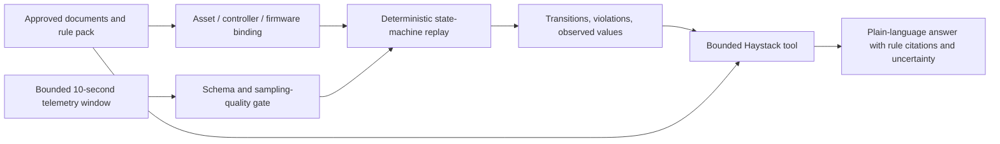

# ADR 003: Governed commercial-HVAC defrost diagnostics

- Status: Accepted for the V2 synthetic vertical slice
- Date: 2026-07-15
- Scope: Read-only evidence analysis; never equipment control
- Evidence: current framework research, public HVAC workflow references, and
  the committed synthetic replay suite

## Decision summary

The requested capability is feasible as a fixed platform **when the platform
combines deterministic temporal analysis with a bounded AI Agent**. It is not
safe or reliable to send a full day of raw ten-second rows directly to a model
and ask it to decide whether defrost logic is correct.

V2 therefore uses this boundary:

The Agent interprets the user's asset and time window, calls the governed tool,
retrieves the relevant configuration/control-sequence evidence, and explains
the deterministic result. It does not invent the rule, execute arbitrary SQL or
Python, browse the Web, or issue control commands.

## Why a model API alone is not enough

A model is useful for natural-language request interpretation, evidence
selection, follow-up questions, and concise explanation. It is the wrong place
to guarantee:

- exact timestamp ordering and dwell calculations;
- duplicate/gap detection;
- versioned rule execution;
- reproducible first-deviation identification;
- complete replay of thousands of samples;
- a stable audit record across model updates.

Those responsibilities remain deterministic and testable. The AI layer receives
only bounded structured evidence and source excerpts.

## V2 implementation

The vertical slice uses mature components instead of custom infrastructure:

- Polars and Pandera for typed CSV validation and bounded time-window filtering;
- `transitions==0.9.3` for the explicit
  `heating -> candidate -> defrost -> recovery` state machine;
- Pydantic for a strict, versioned rule-pack contract;
- Haystack Agent/tool interfaces for governed orchestration and activity trace;
- Hypothesis plus deterministic replay fixtures for timing-boundary coverage.

The synthetic package contains 8,640 rows for 2026-07-15, sampled every ten
seconds. It has one compliant event near 04:00 and one deliberately
non-compliant event near 16:00. The rule pack is bound to fictional asset
`HP-01`, controller `AuroraCTRL-700`, firmware `SYN-3.4.2`, and
`compliance_scope=synthetic_demo`.

## Required company data contract

Before a company result may be called a logic-compliance result, the Project
Package must provide:

1. exact asset/unit identifier;
2. controller model and firmware/software version;
3. effective, approved control-sequence/rule-pack version and source section;
4. timezone and timestamp semantics;
5. expected sample interval and allowed gap/drift;
6. mode, compressor, outdoor-fan, reversing-valve and defrost commands;
7. outdoor-air and outdoor-coil temperatures;
8. the pressures/temperatures needed for any claimed physical diagnosis;
9. data-quality flags, alarm/event markers, and maintenance/change records;
10. the approved time window and immutable source hashes.

If the exact controller/firmware or approved rule source is missing, the system
must refuse a compliance verdict and ask for reviewed evidence. A future
release may support event reconstruction or effect diagnosis only after an
external approval manifest binds the immutable telemetry, rule pack, point
schedule, asset identity, controller, and firmware hashes. It must never infer
exact OEM compliance from uploaded JSON.

## Three evidence scopes

| Scope | What may be claimed | Required evidence |
|---|---|---|
| `synthetic_demo` | The synthetic rows matched or violated the synthetic rule pack. | Committed synthetic rules and telemetry. |
| `event_reconstruction` | Reserved for a future externally approved event reconstruction; V2 rejects this scope. | Immutable telemetry/rule/point-schedule/asset/controller/firmware hashes plus an approval manifest outside the uploaded project. |
| `oem_exact` | Reserved for a future externally approved exact-OEM binding; V2 rejects this scope. | Legally available exact model/firmware documentation, complete required points, immutable dataset/rule/evidence hashes, independent approval manifest, and company engineering sign-off. |

The current public demo is only `synthetic_demo`. V2 fails closed if an uploaded
rule pack self-declares either `event_reconstruction` or `oem_exact`; uploaded
project files cannot approve each other.

## Result language and root-cause boundary

The deterministic engine may report a **confirmed rule violation**, for example:

- entry without a qualified candidate dwell;
- start after the permitted initiation delay;
- outdoor-fan or reversing-valve command mismatch;
- maximum duration exceeded;
- exit before the temperature/time condition;
- fan restart during the recovery delay.

It may also report observed values and the first deviation timestamp. These are
not automatically a physical root cause. Sensor bias, refrigerant charge,
airflow restriction, heat-exchanger fouling, valve failure, pressure
transducers, control overrides, and firmware defects require additional points
and evidence. Future physical diagnosis must label hypotheses as probable and
show which observations support or contradict each hypothesis.

## Ten-second sampling limitations

Ten-second data is usually sufficient to audit dwell rules measured in tens of
seconds or minutes, reconstruct broad command/state order, and identify a first
deviation to the nearest sample. It cannot prove the order of transitions that
occur within one sample interval. Any sub-ten-second interlock, pulse, debounce,
or actuator ordering is `unobservable` unless a faster event log exists.

The quality gate returns `insufficient_data` for an empty window, duplicate
timestamps, failed data-quality flags, or sampling gaps/drift beyond the rule
pack. The maximum interval actually observed in the selected data is compared
directly with the rule's required resolution; tolerance cannot turn 12-second
data into evidence for a 10-second rule. A rule that needs finer timing returns
`unobservable`, not `compliant`.

Sampled command transitions are interval-censored. If the final active sample
is within a time limit but the first cleared sample is beyond it, the engine
cannot know on which side of the limit the command changed. That clause returns
`unobservable`; the same rule applies to a recovery-fan restart that crosses its
allowed threshold between samples. A separately confirmed violation still
keeps the overall result `non_compliant` while identifying the other clause as
unobservable.

## Scale-up boundary

The current CSV/Polars path is intentionally small and local. Move raw telemetry
to partitioned Parquet queried through read-only DuckDB only after measured
company data volume makes bounded CSV windows inadequate. Add CoolProp only for
reviewed thermodynamic calculations and `ruptures` only for measured
change-point use cases. Add Modelica/BOPTEST digital-twin comparison only after
the simpler replay engine has a validated company baseline. Do not introduce a
streaming platform or time-series server before those triggers are measured.

## Safety invariants

- All data access is read-only and project-scoped.
- The tool accepts only an asset and bounded start/end window.
- Rule packs are strict, versioned, and source-linked.
- No arbitrary code, shell, Web, MCP, model-generated SQL, or equipment command
  is available.
- Answers expose citations and concise tool activity, never hidden
  chain-of-thought.
- Missing/ambiguous evidence causes clarification, refusal, or an explicit
  insufficient/unobservable result.

## Public implementation references

- [`transitions`](https://github.com/pytransitions/transitions) supplies the
  maintained state-machine implementation.
- [Polars](https://github.com/pola-rs/polars) and
  [Pandera](https://github.com/unionai-oss/pandera) supply typed tabular
  processing and validation.
- [IBPSA BOPTEST](https://github.com/ibpsa/project1-boptest) and the
  [LBL Modelica Buildings library](https://github.com/lbl-srg/modelica-buildings)
  are later-stage reference environments for controlled building-system
  testing, not dependencies of the V2 vertical slice.
- [EnergyPlus defrost-control fields](https://bigladdersoftware.com/epx/docs/24-2/input-output-reference/group-variable-refrigerant-flow-equipment.html#field-defrost-control-001)
  distinguish reverse-cycle/resistive and timed/on-demand behavior with
  explicit temperatures and time fractions.
- LBL's maintained Modelica Buildings library implements explicit temperature,
  humidity, hysteresis and timed/on-demand branches in
  [`CoilDefrostTimeCalculations.mo`](https://github.com/lbl-srg/modelica-buildings/blob/master/Buildings/Fluid/DXSystems/Heating/BaseClasses/CoilDefrostTimeCalculations.mo)
  and validates an on-demand reverse-cycle case in
  [`SingleSpeed_OnDemandReverseCycleDefrost.mo`](https://github.com/lbl-srg/modelica-buildings/blob/master/Buildings/Fluid/DXSystems/Heating/AirSource/Validation/SingleSpeed_OnDemandReverseCycleDefrost.mo).

No OEM manual, paid standard, vendor table, or real company sequence is copied
into the public repository.
