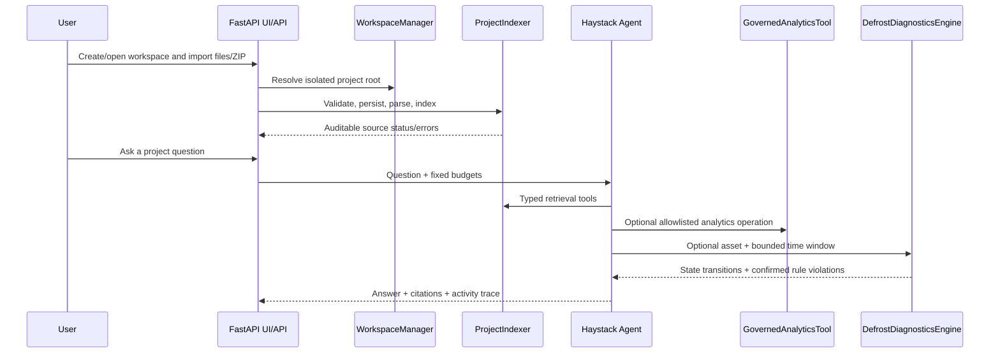

# Architecture

V2 keeps the public application small while assigning retrieval, Agent
orchestration, parsing, dataframes, validation, and SQL parsing to mature
libraries. The accepted decision and evidence matrix are recorded in
[ADR 002](adr/002-v2-governed-workspace-agent.md).
The temporal HVAC boundary is recorded separately in
[ADR 003](adr/003-defrost-temporal-diagnostics.md).

## Runtime flow

## Modules and boundaries

- `workspaces.py`: durable JSON workspace registry and project isolation.
- `ingestion.py`: safe file/ZIP import, source inventory, optional Docling
  parsing, persistent Haystack document stores, BM25/embedding retrieval and
  reciprocal-rank fusion.
- `embeddings.py`: company OpenAI-compatible embeddings behind the same
  HTTPS/exact-host policy as model calls.
- `agent.py`: bounded Haystack Agent and six typed tools. It exposes only a
  concise activity trace, never hidden reasoning.
- `semantic_analytics.py`: allowlisted natural-language analytics operations
  mapped to static governed SQL.
- `analytics.py`: Polars ingestion, Pandera validation, atomic DuckDB snapshots,
  and read-only connections.
- `defrost_diagnostics.py`: strict asset/controller/firmware-scoped rule packs,
  Pandera/Polars quality gates, a maintained `transitions` state machine, and
  deterministic first-deviation evidence for bounded time windows.
- `sql_guard.py`: SQLGlot AST policy, table/function restrictions, and result
  row limits.
- `contract.py`: versioned Project Package validation and path containment.
- `providers.py`, `analysis.py`: retained bounded V1 compatibility paths.
- `release_guard.py`: public-tree secret/internal-data leak prevention.
- `web.py`: FastAPI composition, same-origin mutation header, trusted-host and
  browser security headers.

Imported text is untrusted evidence. It cannot add tools, alter budgets, issue
SQL, open network connections, run Shell/Python, or control equipment.

## Persistence and seams

Each workspace owns source files, metadata, a Haystack document-store snapshot,
and (when a CSV exists) a DuckDB snapshot. Atomic replacement and file locks
protect registry, inventory, and database transitions. Retrieval and model
backends are narrow seams: the default is local BM25 plus a deterministic
test double; production may opt into approved embeddings and an allowlisted
OpenAI-compatible model.

Docling is an optional parser seam. LightRAG is an independent future A/B
candidate, not a current adapter. AnythingLLM remains a separately installed
legacy query-only provider. Any new adapter must pass the same isolation,
egress, citation, hostile-input, and evaluation gates before activation.
