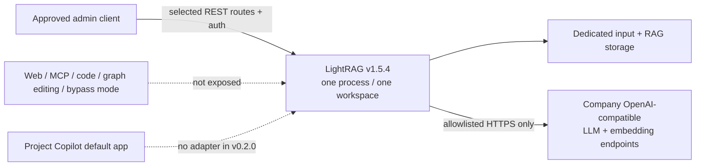

# Optional LightRAG Synthetic A/B Profile

## Status and decision boundary

LightRAG is an **independent, fully synthetic, loopback-only A/B retrieval
candidate**, not the default Project Copilot Workbench backend. Version `0.2.0`
has no LightRAG adapter. Deploying the service does not make the Workbench use
it.

Do not load company data into stable v1.5.4. Security fixes for unauthenticated
network exposure warnings, `/health` configuration disclosure, external-parser
task-ID path injection, container CVEs and non-root execution first appeared in
the v1.5.5rc1 prerelease. Wait for a stable release containing those fixes,
verify the exact source/image again, and repeat the threat model before any
company-data trial.

The default remains the embedded FastAPI/Haystack/DuckDB application because it
is a single reviewed Windows wheel, preserves governed analytics, and has the
smallest attack surface. LightRAG may be adopted later only if the measured A/B
gate in this document passes and a separate adapter/security review is accepted.

This research profile uses one LightRAG process, storage directory, input directory,
port, API key, and account set for exactly one Project Copilot workspace. Do not
treat LightRAG's workspace header as a multi-tenant security boundary. Use only
the repository's CC0 synthetic corpus.



## Verified upstream evidence

The profile was verified on 2026-07-15 against the read-only upstream clone at
tag `v1.5.4`, commit `9a45b64c2ee25b1d806e90db926a8af37480bb16`.

- Release: [LightRAG v1.5.4](https://github.com/HKUDS/LightRAG/releases/tag/v1.5.4)
- Repository: [HKUDS/LightRAG](https://github.com/HKUDS/LightRAG)
- Package: [PyPI `lightrag-hku` 1.5.4](https://pypi.org/project/lightrag-hku/1.5.4/)
- Upstream runbooks: [API server](https://github.com/HKUDS/LightRAG/blob/v1.5.4/docs/LightRAG-API-Server.md),
  [offline deployment](https://github.com/HKUDS/LightRAG/blob/v1.5.4/docs/OfflineDeployment.md),
  and [Docker deployment](https://github.com/HKUDS/LightRAG/blob/v1.5.4/docs/DockerDeployment.md)
- License: MIT
- PyPI wheel: `lightrag_hku-1.5.4-py3-none-any.whl`
- PyPI wheel SHA-256:
  `3bb28b2a763a91fb11b9ac87798140be852891edf71266cff59018d23afeea9d`
- Official multi-architecture image index:
  `ghcr.io/hkuds/lightrag@sha256:de09cd75e32b6b45b104625a9fb229f84f3dec4827ecffc825aa4438b196cbe6`

Security delta requiring a future stable-release re-review:

- [LightRAG v1.5.5rc1](https://github.com/HKUDS/LightRAG/releases/tag/v1.5.5rc1)
- [network exposure without authentication warning](https://github.com/HKUDS/LightRAG/pull/3328)
- [`/health` disclosure authentication](https://github.com/HKUDS/LightRAG/pull/3329)
- [external-parser path injection fix](https://github.com/HKUDS/LightRAG/pull/3324)
- [container CVE/base-image/non-root hardening](https://github.com/HKUDS/LightRAG/pull/3330)

The upstream source confirms these routes used by this profile:

| Operation | Upstream route | Important behavior |
|---|---|---|
| Upload one document | `POST /documents/upload` | Multipart `file`; returns `track_id`; same filename returns HTTP 409 |
| Track one upload | `GET /documents/track_status/{track_id}` | Returns document IDs, status, errors, chunks, and file path |
| Inventory | `POST /documents/paginated` | Page/sort/status inventory and counts |
| Pipeline health | `GET /documents/pipeline_status` | Shows indexing/destructive activity |
| Query | `POST /query` | Supports `hybrid` and `mix`, reranking, references, and optional chunk content |
| Delete | `DELETE /documents/delete_document` | JSON list of document IDs; asynchronous destructive operation |
| Retry failed work | `POST /documents/reprocess_failed` | Retries failed/pending documents; it is not a full re-index |
| Service health | `GET /health` | Includes configuration and endpoint metadata; keep authenticated |

See the project's [recent RAG shortlist](research/2026-07-15-recent-rag-shortlist.md)
for the comparison with RAGFlow, PrivateGPT, PageIndex, GraphRAG, and other
recent repositories.

## Security profile

Apply all of these controls together:

1. Bind the host installation to `127.0.0.1`, or publish a container port only
   to host loopback (`127.0.0.1:9621:9621`).
2. Use a dedicated Windows service account and dedicated directories per
   project.
3. Configure **both** `LIGHTRAG_API_KEY` and `AUTH_ACCOUNTS`/`TOKEN_SECRET`.
   Upstream documents that API-key-only mode leaves the Web UI guest path
   insecure.
4. Set `WHITELIST_PATHS=`. It is an authentication-bypass list, not an egress
   allowlist. In particular, `/health` reveals configured host/model metadata.
5. Do not expose `/webui`, `/docs`, `/openapi.json`, `/api/*`, `/graph/*`,
   `/graphs`, entity/relation mutation, full clear, scan, or cache-clear routes
   to ordinary users or the future Workbench adapter.
6. Permit only `mode=mix` and `mode=hybrid`. Reject `mode=bypass`, which skips
   retrieval and sends the conversation/question directly to the LLM.
7. Omit `conversation_history` and `user_prompt` from the adapter contract
   unless a later threat model explicitly approves them.
8. Leave Langfuse keys absent and `LANGFUSE_ENABLE_TRACE=false`. Do not install
   or connect Web search, MCP, Open WebUI, code execution, external evaluation,
   or other optional integrations.
9. Keep telemetry CSV and governed analytics in Project Copilot's validated,
   read-only DuckDB path. Do not upload operational datasets to LightRAG merely
   because its parser accepts the extension.
10. Enforce outbound destinations with company network controls. LightRAG does
    not provide the Workbench's exact-host egress allowlist.

If a reverse proxy is used, expose only the small adapter route set, require
authentication, rate-limit upload/query/delete, limit body size, remove the
`LIGHTRAG-WORKSPACE` header, and log metadata without request bodies or secrets.

## Option A: pinned Windows wheel deployment

### Prepare an offline bundle on a matching online Windows PC

```powershell
$ErrorActionPreference = "Stop"
$Bundle = "D:\staging\lightrag-1.5.4-offline"
New-Item -ItemType Directory -Force "$Bundle\wheelhouse", "$Bundle\cache" | Out-Null

py -3.12 -m venv "$Bundle\build-venv"
& "$Bundle\build-venv\Scripts\python.exe" -m pip install pip==26.1.2
& "$Bundle\build-venv\Scripts\python.exe" -m pip download `
  "lightrag-hku[api]==1.5.4" --dest "$Bundle\wheelhouse"
& "$Bundle\build-venv\Scripts\python.exe" -m pip install `
  "lightrag-hku[api]==1.5.4"
& "$Bundle\build-venv\Scripts\lightrag-download-cache.exe" `
  --cache-dir "$Bundle\cache\tiktoken"

$NonWheels = Get-ChildItem "$Bundle\wheelhouse" -File |
  Where-Object Extension -ne ".whl"
if ($NonWheels) {
  $NonWheels.FullName
  throw "Offline profile requires Windows wheels for every dependency"
}

$Base = (Resolve-Path $Bundle).Path
Get-ChildItem $Base -Recurse -File |
  Where-Object FullName -notlike "*\build-venv\*" |
  Sort-Object FullName |
  ForEach-Object {
    [pscustomobject]@{
      path = $_.FullName.Substring($Base.Length + 1).Replace("\", "/")
      bytes = $_.Length
      sha256 = (Get-FileHash $_.FullName -Algorithm SHA256).Hash.ToLowerInvariant()
    }
  } | ConvertTo-Json -Depth 3 |
  Set-Content "$Bundle\SHA256SUMS.json" -Encoding utf8
```

Verify that the downloaded LightRAG wheel hash matches the upstream PyPI hash
recorded above. Hash and transfer all transitive wheels; the single upstream
wheel hash is not a dependency-bundle hash.

### Install on the offline company PC

```powershell
$ErrorActionPreference = "Stop"
$Bundle = "D:\ProjectCopilot\releases\lightrag-1.5.4-offline"
$Home = "D:\ProjectCopilot\lightrag\approved_hvac"

py -3.12 -m venv "$Home\venv"
& "$Home\venv\Scripts\python.exe" -m pip install `
  --no-index --find-links "$Bundle\wheelhouse" pip==26.1.2
& "$Home\venv\Scripts\python.exe" -m pip install `
  --no-index --find-links "$Bundle\wheelhouse" `
  "lightrag-hku[api]==1.5.4"
& "$Home\venv\Scripts\python.exe" -m pip check

New-Item -ItemType Directory -Force `
  "$Home\inputs", "$Home\rag_storage", "$Home\logs", "$Home\tiktoken" | Out-Null
Copy-Item "$Bundle\cache\tiktoken\*" "$Home\tiktoken\" -Recurse
```

## Option B: pinned container transfer

The LightRAG service can run as a separate container even though the Project
Copilot application itself is not container-approved. Pull by digest, verify
the upstream Sigstore signature, then save and hash the image for offline
transfer:

```powershell
$Image = "ghcr.io/hkuds/lightrag@sha256:de09cd75e32b6b45b104625a9fb229f84f3dec4827ecffc825aa4438b196cbe6"
docker pull $Image

cosign verify $Image `
  --certificate-identity-regexp '^https://github.com/HKUDS/LightRAG/.github/workflows/(docker-publish|docker-build-manual|docker-build-lite)\.yml@refs/.+$' `
  --certificate-oidc-issuer https://token.actions.githubusercontent.com

docker save --output lightrag-v1.5.4.oci.tar $Image
Get-FileHash lightrag-v1.5.4.oci.tar -Algorithm SHA256
```

On the company PC, verify the transfer hash, run `docker load`, and re-inspect
the image digest. Publish only to host loopback:

```powershell
docker load --input .\lightrag-v1.5.4.oci.tar
docker run --rm `
  --name lightrag-approved-hvac `
  --env-file D:\ProjectCopilot\lightrag\approved_hvac\.env `
  -e LIGHTRAG_API_KEY -e AUTH_ACCOUNTS -e TOKEN_SECRET `
  -e HOST=0.0.0.0 `
  -e WORKING_DIR=/app/data/rag_storage `
  -e INPUT_DIR=/app/data/inputs `
  -e TIKTOKEN_CACHE_DIR=/app/data/tiktoken `
  -e LOG_DIR=/app/data/logs `
  -p 127.0.0.1:9621:9621 `
  -v D:\ProjectCopilot\lightrag\approved_hvac\rag_storage:/app/data/rag_storage `
  -v D:\ProjectCopilot\lightrag\approved_hvac\inputs:/app/data/inputs `
  -v D:\ProjectCopilot\lightrag\approved_hvac\tiktoken:/app/data/tiktoken `
  -v D:\ProjectCopilot\lightrag\approved_hvac\logs:/app/data/logs `
  $Image
```

The company registry may mirror the image, but the approval record must retain
the upstream digest, mirror digest, signature result, SBOM/scan result, and
platform (`linux/amd64`).

## Non-secret `.env` profile

LightRAG loads `.env` from its startup directory and gives process environment
variables precedence. Store only non-secret settings in the file. Inject API
keys, password hashes, and token secrets through the approved service manager.

```dotenv
HOST=127.0.0.1
PORT=9621
WORKING_DIR=D:/ProjectCopilot/lightrag/approved_hvac/rag_storage
INPUT_DIR=D:/ProjectCopilot/lightrag/approved_hvac/inputs
TIKTOKEN_CACHE_DIR=D:/ProjectCopilot/lightrag/approved_hvac/tiktoken
LOG_DIR=D:/ProjectCopilot/lightrag/approved_hvac/logs
LOG_LEVEL=INFO
WORKERS=1
WEBUI_TITLE=Approved HVAC Retrieval A-B
WEBUI_DESCRIPTION=One-workspace evaluation service

LLM_BINDING=openai
LLM_BINDING_HOST=https://ai-gateway.example.invalid/v1
LLM_MODEL=approved-model-id
EMBEDDING_BINDING=openai
EMBEDDING_BINDING_HOST=https://ai-gateway.example.invalid/v1
EMBEDDING_MODEL=approved-embedding-id
EMBEDDING_DIM=REPLACE_WITH_APPROVED_DIMENSION

RERANK_BINDING=null
ENABLE_LLM_CACHE=false
LIGHTRAG_PARSER=*:native-teP;*:legacy-R
VLM_PROCESS_ENABLE=false
MAX_UPLOAD_SIZE=50000000
MAX_PARALLEL_INSERT=1
CORS_ORIGINS=http://127.0.0.1:9621
WHITELIST_PATHS=
LANGFUSE_ENABLE_TRACE=false
```

The embedding model, dimension, and asymmetric embedding settings are immutable
for an existing index. Changing them requires a new workspace/storage directory
and full re-index. Do not guess the embedding dimension.

Inject secrets immediately before starting the service:

```powershell
$env:LIGHTRAG_API_KEY = Get-Secret -Name "LightRAG-API-Key" -AsPlainText
$env:AUTH_ACCOUNTS = Get-Secret -Name "LightRAG-Auth-Accounts" -AsPlainText
$env:TOKEN_SECRET = Get-Secret -Name "LightRAG-Token-Secret" -AsPlainText
$env:LLM_BINDING_API_KEY = Get-Secret -Name "Company-LLM-Key" -AsPlainText
$env:EMBEDDING_BINDING_API_KEY = Get-Secret -Name "Company-Embedding-Key" -AsPlainText
$env:SSL_CERT_FILE = "C:\CompanyPKI\company-ca-bundle.pem"
```

Generate the bcrypt account entry interactively; do not store a plaintext
password:

```powershell
& "D:\ProjectCopilot\lightrag\approved_hvac\venv\Scripts\lightrag-hash-password.exe" `
  --username admin
```

Start one host process for the one workspace:

```powershell
Set-Location "D:\ProjectCopilot\lightrag\approved_hvac"
& ".\venv\Scripts\lightrag-server.exe" `
  --host 127.0.0.1 --port 9621 `
  --workspace approved_hvac
```

## TLS, company endpoints, and egress

For outbound LLM/embedding TLS, use the company Windows trust store or an
approved PEM bundle through `SSL_CERT_FILE`, then prove the connection without
disabling verification. For inbound remote administration, terminate TLS and
authentication at an independently reviewed reverse proxy; the direct service
remains loopback-only.

LightRAG has provider configuration but no exact-host outbound allowlist like
Project Copilot. Enforce the following at the firewall/gateway:

- allow only the configured company LLM and embedding hostnames/IPs on the
  approved port;
- deny public model APIs, package indexes, GitHub, Hugging Face, tokenizer
  downloads, Langfuse, evaluation endpoints, Web search, and MCP;
- pre-download tokenizer/parser assets and prove startup/import/query with the
  network blocked;
- capture process connections during the same synthetic A/B workload.

If the company gateway uses a private CA, record the CA bundle hash and verify
hostname/SAN, chain, expiry, revocation policy, and system time. Do not use
`--insecure` or an unverified HTTP endpoint.

## Project Package import mapping

LightRAG has no Project Copilot Project Package contract. Import only the
approved document subset from an already validated/unpacked package. Keep CSV
telemetry in Project Copilot's governed analytics path.

1. Validate and inventory the Project Package with Project Copilot.
2. Copy document files to a clean staging directory.
3. Resolve duplicate basenames; LightRAG treats filename as the document key.
4. Upload one file per request.
5. Persist each `track_id`, wait for terminal status, and record document IDs.
6. Compare LightRAG filenames/count/status to the Project Package inventory,
   and independently hash the files in the dedicated `INPUT_DIR`. The upstream
   paginated inventory does not expose a source SHA-256 field.

### Upload and status

```powershell
$Base = "http://127.0.0.1:9621"
$ApiKey = $env:LIGHTRAG_API_KEY
$Document = "D:\ApprovedImports\meeting-2026-07-01.md"

$Upload = curl.exe --silent --show-error --fail-with-body `
  -X POST "$Base/documents/upload" `
  -H "X-API-Key: $ApiKey" `
  -F "file=@$Document" | ConvertFrom-Json

$Upload | ConvertTo-Json -Depth 5
$Track = Invoke-RestMethod `
  -Uri "$Base/documents/track_status/$($Upload.track_id)" `
  -Headers @{ "X-API-Key" = $ApiKey }
$Track | ConvertTo-Json -Depth 10
```

Do not query until every uploaded document is `PROCESSED`. Treat `FAILED`,
duplicate content, parser error, or missing chunks as an import failure.

### Inventory

```powershell
$InventoryBody = @{
  page = 1
  page_size = 200
  sort_field = "file_path"
  sort_direction = "asc"
} | ConvertTo-Json

$Inventory = Invoke-RestMethod `
  -Method Post -Uri "$Base/documents/paginated" `
  -Headers @{ "X-API-Key" = $ApiKey } `
  -ContentType "application/json" -Body $InventoryBody
$Inventory | ConvertTo-Json -Depth 10
```

Paginate until `has_next=false`; do not assume the first 200 records are the
complete corpus.

### Bounded query with citations

```powershell
$QueryBody = @{
  query = "Which meeting changed the chilled-water setpoint, and why?"
  mode = "mix"
  enable_rerank = $false
  include_references = $true
  include_chunk_content = $true
  top_k = 20
  chunk_top_k = 10
  max_total_tokens = 12000
  stream = $false
} | ConvertTo-Json -Depth 5

$Answer = Invoke-RestMethod `
  -Method Post -Uri "$Base/query" `
  -Headers @{ "X-API-Key" = $ApiKey } `
  -ContentType "application/json" -Body $QueryBody
$Answer | ConvertTo-Json -Depth 10
```

The future adapter must map `references[].file_path` and optional chunk
`content` back to Project Copilot source IDs. A filename alone is not a complete
Project Copilot citation contract.

### Delete and re-index mapping

```powershell
$DeleteBody = @{
  doc_ids = @("REPLACE_WITH_DOCUMENT_ID")
  delete_file = $true
  delete_llm_cache = $true
} | ConvertTo-Json

Invoke-RestMethod `
  -Method Delete -Uri "$Base/documents/delete_document" `
  -Headers @{ "X-API-Key" = $ApiKey } `
  -ContentType "application/json" -Body $DeleteBody
```

Deletion is asynchronous. Poll inventory and pipeline status until the document
and its citations are gone.

LightRAG v1.5.4 has no “re-index this complete Project Package” route. The
Project Copilot re-index mapping is therefore: export the approved inventory,
delete the selected documents, wait for deletion, re-upload the same approved
files, wait for `PROCESSED`, and rerun the evaluation. `reprocess_failed` is
only for failed/pending work and must not be documented as a full re-index.

## Backup, restore, and rollback

Stop the LightRAG process before copying its state. Back up:

- pinned application version/digest and dependency/image manifests;
- `.env` without secrets;
- `WORKING_DIR`, `INPUT_DIR`, tokenizer cache, and prompts if customized;
- model/embedding/reranker identifiers and dimensions;
- endpoint/CA hashes without credentials;
- document inventory, track IDs, evaluation results, and network evidence.

Restore into a new directory and port, inject recreated secrets, start with the
same embedding configuration, and run health/inventory/query/delete checks. Do
not point a downgraded binary at a storage directory already migrated by a
newer version. Rollback means previous binary/image **plus** its matching
pre-upgrade storage snapshot.

## A/B adoption gate

Run the same frozen synthetic HVAC corpus, questions, company model/embedding
configuration, retrieval limits, and machine class against embedded mode and
LightRAG. Record raw per-case JSON and timings; do not publish an invented
quality percentage.

LightRAG can advance to adapter work only when all conditions pass:

1. Every Windows offline install, authentication, endpoint allowlist,
   no-unapproved-egress, backup/restore, delete, and rollback test passes.
2. Exact lookup, configuration conflict, clarification, refusal, and hostile
   input cases have no regression.
3. Cross-document/temporal cases have at least one additional fully correct
   answer with supporting source/chunk citations; a tie keeps embedded mode.
4. Citation coverage and citation correctness are not lower on any required
   class.
5. Index time, storage size, query p50/p95, model calls, and failures are
   measured and stay inside company-approved budgets.
6. The future adapter exposes only upload/status/inventory/query/delete,
   enforces `mix`/`hybrid`, maps citations to source IDs, and cannot reach graph
   mutation, WebUI, Web, MCP, code, shell, physical controls, or unrestricted
   analytics.
7. Independent review reports no release-blocking Critical or Important issue.

If any mandatory result fails, or quality is tied, keep the embedded default
and retain LightRAG as research evidence only.

## Troubleshooting

| Symptom | Cause/check | Action |
|---|---|---|
| Guest can use APIs | Only API key configured or whitelist too broad | Configure both account auth and API key; set `WHITELIST_PATHS=` |
| HTTP 409 on upload | Same canonical basename already exists or destructive job active | Inventory/delete first, or wait for pipeline idle |
| Upload accepted but later fails | Content duplicate, parser/model error, unavailable company endpoint | Inspect `track_status` and `error_msg`; do not hide failed sources |
| Query has no chunk text | `include_chunk_content` omitted/false | Enable it only for controlled evaluation/citation mapping |
| Query bypasses evidence | `mode=bypass` | Block the request; permit only `mix`/`hybrid` |
| TLS error to company model | Private CA absent or hostname mismatch | Install/provide the approved CA; never disable verification |
| Offline startup tries Internet | Missing tokenizer/parser/provider assets | Rebuild bundle online, repeat no-egress test, and hash the added assets |
| Answers change after embedding update | Index built with different vector semantics | Restore the old configuration or create a new storage directory and re-index |
| Delete returns `busy` | Index/scan/enqueue active | Wait for `pipeline_status` to become inactive, then retry once |
| Workbench still uses embedded retrieval | Expected in v0.2.0 | No LightRAG adapter exists; run only the A/B harness until a reviewed adapter lands |
